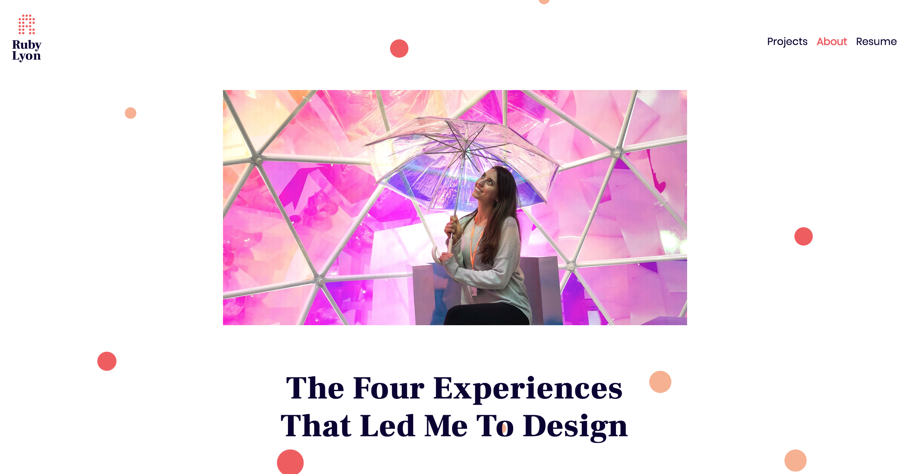

# rubyana88.github.io

**Ruby Lyon Portfolio**

Hello,
I’m Ruby, an NYC-based product designer specializing in UI and UX design. I love all aspects of human-centered design and creating products from conception to completion. My extra special sauce is my ability to tie together design with my branding and marketing background to create joyful, accessible, and viable products.

Welcome to my portfolio––pleae explore around and learn more about my projects and interests! 

